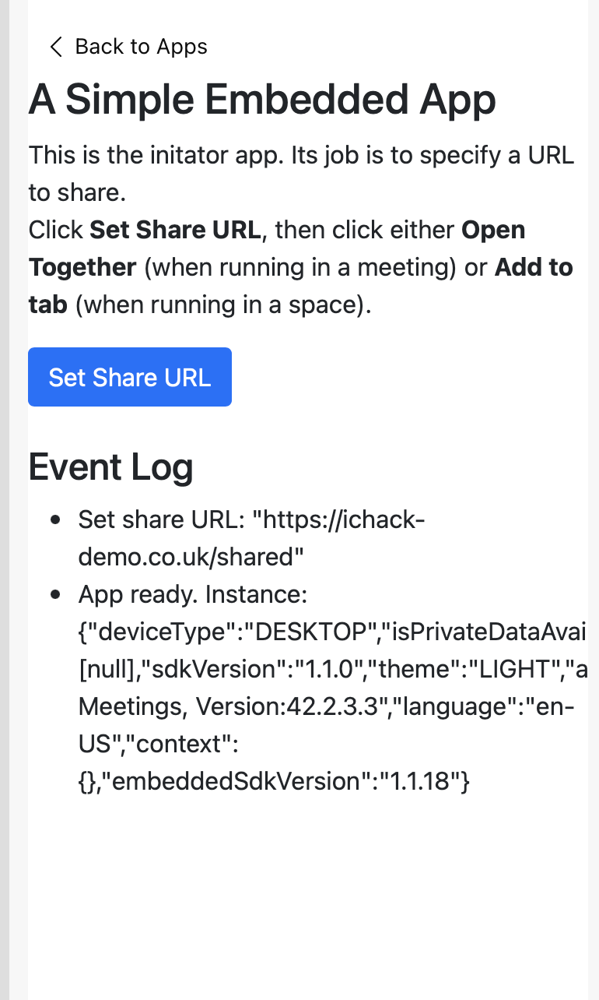

# Creating a simple WebEx embedded app
Getting started with creating a WebEx embedded app

For more details go to this developer quick start page:
https://developer.webex.com/docs/embedded-apps-guide#developer-quick-start

## Getting started
### Things needed to get started
To allow the web app to be accessed witin the embedded app framework it needs to be hosted using a publically accessible url using https. During the ICHack workshop an example url of ichack-demo.co.uk will be available to use.

### Step 1 
Create an account on developer.webex.com and 

### Step 2
Within My Webex Apps (accessed from clicking your user icon) create a new embedded app.

### Step 3
Add all the required information, including the start page url. The start page url will be the page that is displayed when the user first opens the app. In the case of the example the starting page can be set to be https://ichack-demo.co.uk and the valid domains ichack-demo.co.uk. Another shared url will be used to share the app with multiple participants in the meeting.

### Step 4
Download and log into the Webex Desktop client on your device. https://www.webex.com/downloads.html

### Step 5
Start a meeting using your personal room. This can be found from the meetings section of the teams client. Get a friend to join the meeting as well

### Step 6
Click on Apps in the bottom right hand corner. Your app should appear as an option. A selection of data sharing messages will be shown. Accept this if you are happy to share your user information.

### Step 7
Once the shared url is set, you can click on Open Together, which will then share the app with your friends in the meeting.

### Initiator App 
The initiator app sets the shared url and opens the shared session

### Shared App
The shared app is what all other participants in the meeting will see 

## Example Code
The code provided shows some example APIs that are available within the Webex Embedded App framework.

There are 4 main files:
* index.html
* index.js
* shared.html
* shared.js

The index.html file contains the initiator page for the app. This will be shown to the user who starts the embedded app. The index.js contains functions to be able to set the shared url  within the Webex embedded app.

The shared.html file is the file that is shared with all participants in the meeting. The shared.js file has some examples of using the event listeners and also getting user information.
